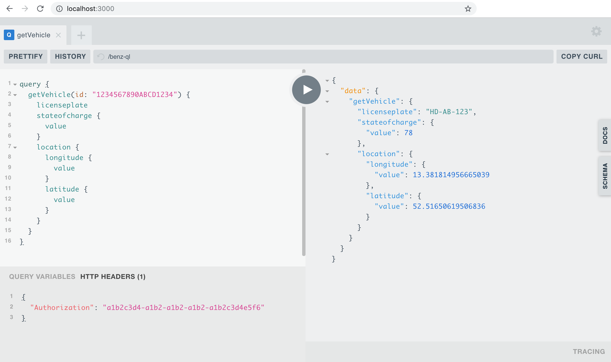

# benz-ql

## Getting started

To get started install the package.

`yarn add benz-ql`

### Setting up the server

Package can be used with different server frameworks supported by Apollo.
In this example we will use express-based server.

```js
import express from "express";
import { ApolloServer } from "apollo-server-express";
import benzQL from "benz-ql";

const app = express();
const PORT = 3000;
const server = new ApolloServer(benzQL("SANDBOX")); // chose your environment - SANDBOX or PROD

server.applyMiddleware({ app, path: "/benz-ql" });

app.listen(PORT, () => {
  console.log(`App listen on ${PORT}`);
  console.log(`Benz-ql avaliable on ${server.graphqlPath}`);
});
```

### Connecting from the client

```js
import React from "react";
import { View, Text } from "react-native";
import ApolloClient, { gql } from "apollo-boost";

const client = new ApolloClient({
  uri: "http://localhost:3000/benz-ql",
  headers: {
    authorization: "a1b2c3d4-a1b2-a1b2-a1b2-a1b2c3d4e5f6"
  }
});

class Home extends React.Component {
  state = { batteryStatus: "unknown" };

  async componentDidMount() {
    const { data, error } = await client.query({
      query: gql`
        query {
          getVehicle(id: "1234567890ABCD1234") {
            stateofcharge {
              value
            }
          }
        }
      `
    });

    if (!error) {
      this.setState({
        batteryStatus: data.getVehicle.stateofcharge.value
      });
    }
  }

  render() {
    const { batteryStatus } = this.state;
    return (
      <View>
        <Text>Battery Status: {batteryStatus}</Text>
      </View>
    );
  }
}
```

### Sample query

This query will get data from three different REST endpoint at once

```js
query {
  getVehicle(id: "1234567890ABCD1234") {
    licenseplate
    stateofcharge {
      value
    }
    location {
      longitude {
        value
      }
      latitude {
        value
      }
    }
  }
}
```

You can browse query response by running example server and using build-in Prisma graphql-playground or using the deployed version [here](https://benz-ql.herokuapp.com/).

[](https://benz-ql.herokuapp.com/)

### Run example server

1. Clone this repo
2. `yarn install`
3. `cd example`
4. `node index.js`
5. Open [http://localhost:3000](http://localhost:3000)

> Example server uses sandbox environment.

## Coverage table

<table>
  <tr>
    <th>API Name</th>
    <th>API Resource</th>
    <th>Status</th>
  </tr>
  <tr>
    <td rowspan="7">Connected Vehicle (experimental)</td>
    <td>Vehicles</td>
    <td>implemented</td>
  </tr>
  <tr>
    <td>Tires</td>
    <td>pending</td>
  </tr>
  <tr>
    <td>Doors</td>
    <td>pending</td>
  </tr>
  <tr>
    <td>Location</td>
    <td>implemented</td>
  </tr>
  <tr>
    <td>Odometer</td>
    <td>pending</td>
  </tr>
  <tr>
    <td>Fuel</td>
    <td>pending</td>
  </tr>
  <tr>
    <td>State of Charge</td>
    <td>implemented</td>
  </tr>
  <tr>
    <td rowspan="4">Car Configurator</td>
    <td>References</td>
    <td>pending</td>
  </tr>
  <tr>
    <td>Configurations</td>
    <td>pending</td>
  </tr>
  <tr>
    <td>Images</td>
    <td>pending</td>
  </tr>
  <tr>
    <td>Saved configurations</td>
    <td>pending</td>
  </tr>
  <tr>
    <td rowspan="2">Dealer</td>
    <td>Dealer search</td>
    <td>pending</td>
  </tr>
  <tr>
    <td>References</td>
    <td>pending</td>
  </tr>
  <tr>
    <td rowspan="4">Electric Vehicle Status</td>
    <td>Container Electric Vehicle Status</td>
    <td>pending</td>
  </tr>
  <tr>
    <td>Resources</td>
    <td>pending</td>
  </tr>
  <tr>
    <td>State of charge resource</td>
    <td>pending</td>
  </tr>
  <tr>
    <td>Range electric resource</td>
    <td>pending</td>
  </tr>
  <tr>
    <td rowspan="4">Fuel Status</td>
    <td>Container Fuel Status</td>
    <td>pending</td>
  </tr>
  <tr>
    <td>Resources</td>
    <td>pending</td>
  </tr>
  <tr>
    <td>Tank level resource</td>
    <td>pending</td>
  </tr>
  <tr>
    <td>Range liquid resource</td>
    <td>pending</td>
  </tr>
  <tr>
    <td rowspan="3">Pay As You Drive Insurance</td>
    <td>Container Pay As You Drive Insurance</td>
    <td>pending</td>
  </tr>
  <tr>
    <td>Resources</td>
    <td>pending</td>
  </tr>
  <tr>
    <td>Odometer resource</td>
    <td>pending</td>
  </tr>
  <tr>
    <td rowspan="4">Remote Diagnostic Support</td>
    <td>Resources</td>
    <td>pending</td>
  </tr>
  <tr>
    <td>Electronical Control Units (ECU's)</td>
    <td>pending</td>
  </tr>
  <tr>
    <td>Diagnostic Trouble Codes (DTC's)</td>
    <td>pending</td>
  </tr>
  <tr>
    <td>Diagnostic Trouble Code (DTC) Snapshots</td>
    <td>pending</td>
  </tr>
  <tr>
    <td rowspan="2">Vehicle Images</td>
    <td>Vehicle Images Basic</td>
    <td>pending</td>
  </tr>
  <tr>
    <td>Vehicle Images 360</td>
    <td>pending</td>
  </tr>
  <tr>
    <td rowspan="5">Vehicle Lock Status</td>
    <td>Resources</td>
    <td>pending</td>
  </tr>
  <tr>
    <td>Door Lock Status Resource</td>
    <td>pending</td>
  </tr>
  <tr>
    <td>Door Lock Deck Lid Status Resource</td>
    <td>pending</td>
  </tr>
  <tr>
    <td>Door Lock Gas Status Resource</td>
    <td>pending</td>
  </tr>
  <tr>
    <td>Position Heading Resource</td>
    <td>pending</td>
  </tr>
  <tr>
    <td rowspan="18">Vehicle Status</td>
    <td>Container Vehicle Status</td>
    <td>pending</td>
  </tr>
  <tr>
    <td>Resources</td>
    <td>pending</td>
  </tr>
  <tr>
    <td>Decklid resource</td>
    <td>pending</td>
  </tr>
  <tr>
    <td>Front left door resource</td>
    <td>pending</td>
  </tr>
  <tr>
    <td>Front right door resource</td>
    <td>pending</td>
  </tr>
  <tr>
    <td>Rear left door resource</td>
    <td>pending</td>
  </tr>
  <tr>
    <td>Rear right door resource</td>
    <td>pending</td>
  </tr>
  <tr>
    <td>Interior front light resource</td>
    <td>pending</td>
  </tr>
  <tr>
    <td>Interior rear light resource</td>
    <td>pending</td>
  </tr>
  <tr>
    <td>Light switch position resource</td>
    <td>pending</td>
  </tr>
  <tr>
    <td>Front left reading lamp resource</td>
    <td>pending</td>
  </tr>
  <tr>
    <td>Front right reading lamp resource</td>
    <td>pending</td>
  </tr>
  <tr>
    <td>Convertible (roof top) resource</td>
    <td>pending</td>
  </tr>
  <tr>
    <td>Sunroof resource</td>
    <td>pending</td>
  </tr>
  <tr>
    <td>Front left windows resource</td>
    <td>pending</td>
  </tr>
  <tr>
    <td>Front right windows resource</td>
    <td>pending</td>
  </tr>
  <tr>
    <td>Rear left windows resource</td>
    <td>pending</td>
  </tr>
  <tr>
    <td>Rear right windows resource</td>
    <td>pending</td>
  </tr>
</table>

## Development

To run example server in development mode run

`yarn dev`
